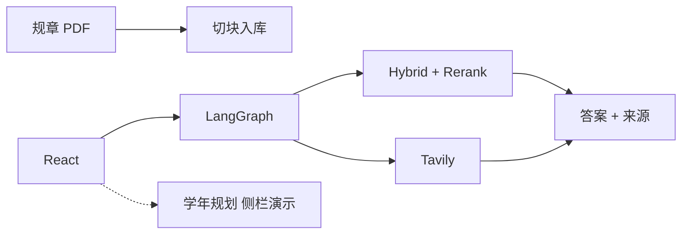
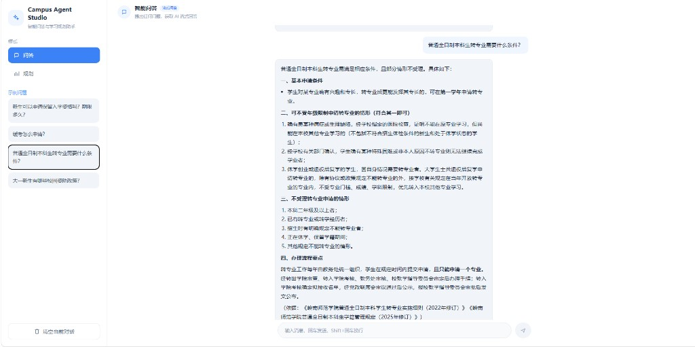
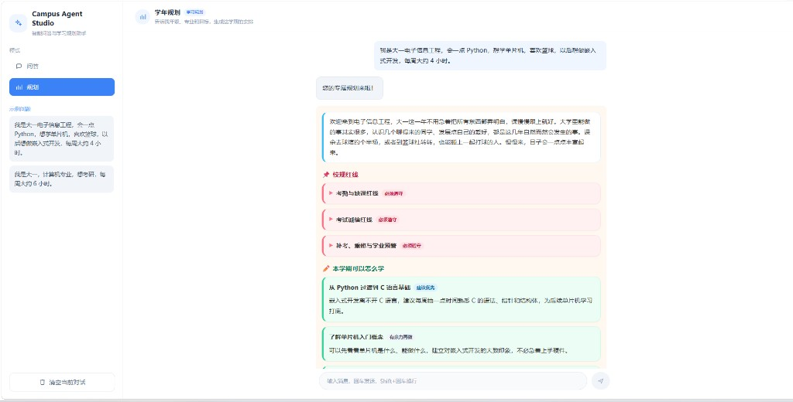

# 制度文档问答（RAG + Agent）

独立开发。面向高校公开教务规章的可溯源问答：校内规定检索知识库，时效资讯调用网页搜索，证据不足则拒答。

语料为岭南师范学院公开 PDF，评测数字针对知识库 RAG 链路。

[](https://www.python.org/)
[](https://fastapi.tiangolo.com/)
[](https://www.langchain.com/)
[](https://langchain-ai.github.io/langgraph/)
[](https://github.com/explodinggradients/ragas)

---

## 项目亮点

1. **制度问答优先保证不编造**：30 题拒答回归（该答 / 部分答 / 该拒各 10），幻觉 **0/30**，该拒题未输出价格、时刻或网址；行为准确 **27/30**。另 3 题在有制度但缺精确字段时整句拒答（过拒）。金标见 `evaluation/refusal_gold.json`。
2. **用对照实验验收检索改动**：50 道自建题 + Ragas，对比接入 Rerank 前后。Context Precision **0.73 → 0.79**，Answer Relevancy **0.65 → 0.83**，Context Recall **0.74 → 0.88**，Faithfulness **0.86 → 0.89**。
3. **回答附带原文页码**：PDF 按页入库，Recursive 切块（256 / overlap 50）→ Query 改写 → Hybrid（稠密向量 + jieba BM25 + RRF）→ `bge-reranker-v2-m3` 将 Top10 精排为 Top3，响应携带 PDF 名与页码。
4. **校内规章与公开资讯分通道取值**：LangGraph（`summarize` → `think` → `act` → `observe`）按问题选择工具——规定走 `search_lingnan_knowledge_base`，公开资讯走 Tavily；系统提示约束网页结果不得作为官方规章依据。
5. **多轮状态放在服务端**：请求只传 `question` + `thread_id`。Graph 使用 SQLite checkpointer 持久化 state，超过 5 轮先摘要再裁剪消息。

主线为教务 PDF 问答（RAG + LangGraph Agent）。学年规划为侧栏附加演示，见「功能演示」。

---

## 技术栈

| 层级 | 技术 |
|------|------|
| 前端 | React、Vite、Tailwind；SSE |
| API | FastAPI、Pydantic |
| Agent | LangChain tools、LangGraph、SQLite checkpointer、DeepSeek |
| RAG | Chroma、BGE Embedding、jieba + BM25、RRF、bge-reranker |
| 联网 | Tavily |
| 评估 | Ragas、自建 50 题 / 30 题拒答集 |
| 工程 | Docker Compose、Redis 限流、`.env`；MySQL / JWT 用户接口为附带能力 |

---

## 系统架构



主路径：React 页请求 `POST /agent/stream`（`question` + `thread_id`）。校内规定检索知识库，公开资讯可走联网；SSE 输出思考、工具步骤、正文和来源。

`POST /chat/stream` 为纯 RAG 兼容接口，供评测脚本使用。学年规划走 `POST /planning/stream`，按 `session_id` 保存在内存，与问答 `thread_id` 隔离。

---

## 评测结果

评估对象为**知识库 RAG**。实验设置与逐题分析：[docs/evaluation_report.md](./docs/evaluation_report.md)。Agent + 联网路径尚未做同规模对照。

### Ragas（50 题）

| 指标 | 无 Rerank | 有 Rerank | 差值 |
|------|----------:|----------:|-----:|
| Context Precision | 0.73 | **0.79** | +0.06 |
| Context Recall | 0.74 | **0.88** | +0.14 |
| Faithfulness | 0.86 | **0.89** | +0.03 |
| Answer Relevancy | 0.65 | **0.83** | +0.18 |

Rerank 提升进入生成阶段的 Top3 质量；召回范围仍由 Hybrid Top10 决定。两边 Context Recall 为 0 的题目需从切块 / 初筛排查。脚本：`evaluation/eval_with_ragas.py`。

### 拒答回归（30 题）

| 指标 | 结果 |
|------|------|
| 题型 | 该答 10 / 部分答 10 / 该拒 10 |
| 行为准确 | **27/30** |
| 误拒 | **3/30**（心理电话、转专业名额、宿舍房型等「有制度缺字段」时整句拒答） |
| 幻觉 | **0/30**（该拒题未编价格 / 时刻 / 网址） |

脚本：`evaluation/eval_refusal.py`。

---

## 功能演示

**主线：知识库问答（出处为 PDF 名 / 页码）**



**附加演示：学年规划（侧栏切换）**

面向大一理工科：年级与专业齐全后生成学年安排。校规红线由知识库检索写入（过滤文件名含「研究生」的命中），竞赛信息来自网页，学习建议由模型生成。Tavily 不可用时仍输出校规。会话按 `session_id` 存在内存，进程重启后失效。规划模块未单独建立评测集。



---

## 难点与工程取舍

1. **中文专名检索**  
   - **问题**：问句依赖「三助一辅」「学业预警」等专名。按连续汉字正则切词时，BM25 几乎失效，Hybrid Top3 混入无关文档。  
   - **方案**：改用 jieba，并将三助一辅、国家奖学金、国家助学金、学业奖学金、保留入学资格、学业预警、勤工助学写入词表。  
   - **权衡**：关键字通道可用，词表需随语料维护；未入库专名仍可能切分失败。

2. **初筛命中后的排序**  
   - **问题**：「怎么申请」类问题中，流程条款已进入 Hybrid Top10，但常排在申请条件 / 岗位职责之后。  
   - **方案**：对 Hybrid Top10 做 `bge-reranker-v2-m3` 精排，截断为 Top3 再生成。  
   - **权衡**：Top3 相关性上升（见上表）；精排不扩大召回，未进入 Top10 的块无法被重排补回，需从切块和初筛处理。

3. **部分相关上下文的生成策略**  
   - **问题**：检索结果覆盖制度框架、但缺少电话 / 名额 / 房型等字段时，模型容易补全数字。  
   - **方案**：关键字段缺失时整句拒答，用 30 题回归约束该行为。  
   - **权衡**：该拒题幻觉为 0；3 题过拒，召回完整度让位于事实约束。

4. **知识库与联网的路由**  
   - **问题**：同一入口既要答校内规章，也要查公开资讯，两路证据不能互相替代。  
   - **方案**：LangGraph 单图挂载知识库检索与 Tavily 两个工具，由模型按问题选择；系统提示规定校规结论只采知识库。  
   - **权衡**：链路短、延迟与状态管理集中；来源隔离依赖工具选择与 Prompt 约束，未再拆分子图。

---

## 当前不足与后续

- 50 / 30 题结论不能外推到全部规章问答；Agent 联网路径尚未做同规模评测  
- 仍有题目两边 Context Recall 为 0，精排无法补救  
- 3 题过拒：上下文有制度、缺精确字段时整句拒答  
- 学年规划为侧栏演示：内存会话、无账号、与问答入口分离  
- Rerank / Tavily 依赖外部 API；模型无内置实时时钟  

后续优先：为 Agent 联网路径补小规模回归；对 Recall=0 的题目回溯切块与初筛；过拒题改为输出证据支持的部分并声明未覆盖字段。

---

## 附录

### 目录

```text
lingnan-university-rag/     # 本仓库：API、RAG、评测
├── app/
│   ├── agent/              # LangGraph：think / act / observe、工具、SSE
│   ├── planning/           # 学年规划演示
│   ├── rag/                # 改写 / Hybrid / Rerank / Tavily
│   └── routers/            # users / auth / chat / agent / planning
├── scripts/ingest_pdfs.py
├── evaluation/             # Ragas 与拒答金标、结果 json
├── docs/evaluation_report.md
└── docker/

academic-rag-frontend/      # 产品页：React 问答 / 规划，消费上列 SSE
```

### API

| 方法 | 路径 | 说明 |
|------|------|------|
| GET | `/health` | 健康检查 |
| POST | `/agent/stream` | 主接口：`{ question, thread_id }`，SSE |
| POST | `/planning/stream` | 规划演示：`{ question, session_id }`，SSE |
| POST | `/chat/stream` | 兼容纯 RAG 流式（评测用） |

### `/agent/stream` SSE 事件

| event | 含义 |
|------|------|
| `thought` | 调用工具前的思考 |
| `action` | 即将调用的工具名与参数 |
| `observation` | 工具返回摘要 |
| `token` | 最终回答的流式增量 |
| `sources` | 知识库页码或网页链接 |
| `error` | 失败信息 |
| `done` | 本轮结束 |
