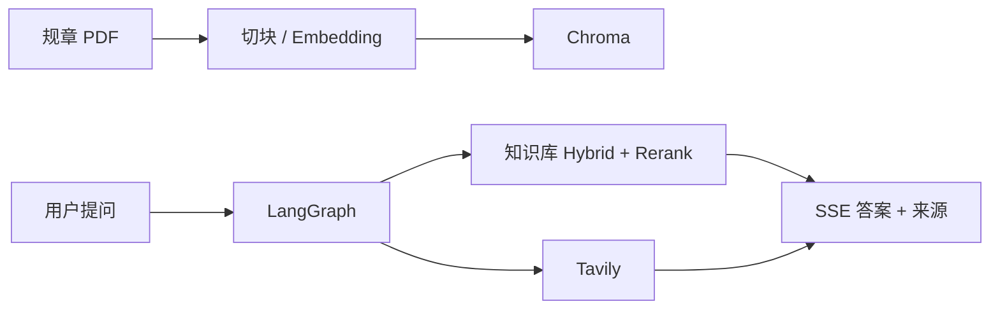

# 制度文档问答（RAG + Agent）

> 个人项目（独立完成），面向制度类 PDF 的知识问答（语料为岭南师范学院公开教务规章）：Hybrid 检索 + Rerank，Agent 按问题调用校内知识库或 Tavily；资料不足则拒答并回传来源。侧栏另有学年规划演示。

[](https://www.python.org/)
[](https://fastapi.tiangolo.com/)
[](https://www.langchain.com/)
[](https://langchain-ai.github.io/langgraph/)
[](https://github.com/explodinggradients/ragas)

直接问大模型教务规定，容易答错或编造。本项目把规章切块入库，由 Agent 按需检索再生成：校内规定走知识库，公开/时效资讯可走网页（不得冒充官方规章），答不了就拒。

---

## 项目亮点

1. **检索链路完整**：PDF 按页入库 → Recursive 切块 → BGE Embedding → Query 改写 → Hybrid（向量 + BM25 + RRF）→ `bge-reranker-v2-m3` 精排 Top3 → 流式生成，并回传 PDF 名/页码  
2. **Agent 工具分流**：`POST /agent/stream` 上 LangGraph（`summarize` → `think` → `act` → `observe`）。校内规定走 `search_lingnan_knowledge_base`，公开资讯走 `search_web_messages`（Tavily）  
3. **多轮记忆**：前端只传 `question` + `thread_id`，不传聊天历史。Graph 用 SQLite checkpointer；轮次多了先摘要再裁剪  
4. **有对照实验**：50 道自建题 + Ragas，对比有无 Rerank；Context Precision **0.73 → 0.79**，Answer Relevancy **0.65 → 0.83**  
5. **拒答有回归集**：30 题（该答 / 部分答 / 该拒各 10），**误拒 3、幻觉 0**，不单凭感觉调 Prompt  

学年规划是同一套知识库上的垂直演示：大一理工科聊出画像后，校规红线由检索写入、竞赛走网页、学习建议才让模型写。入口在侧栏切换，不和教务问答抢同一个输入框。

### Ragas（50 题，知识库 RAG）

| 指标 | 无 Rerank | 有 Rerank | 差值 |
|------|----------:|----------:|-----:|
| Context Precision | 0.73 | **0.79** | +0.06 |
| Context Recall | 0.74 | **0.88** | +0.14 |
| Faithfulness | 0.86 | **0.89** | +0.03 |
| Answer Relevancy | 0.65 | **0.83** | +0.18 |

Rerank 改善进入生成的 Top3；它**不能**捞回 Hybrid Top10 以外的块。Recall 仍为 0 的题要回到切块 / 初筛。过程见 [docs/evaluation_report.md](./docs/evaluation_report.md)。

### 拒答回归（30 题）

| 指标 | 结果 |
|------|------|
| 行为准确 | **27/30** |
| 误拒 | **3/30**（有制度但缺电话 / 名额 / 房型等字段时整句拒答） |
| 幻觉 | **0/30**（该拒题未编价格 / 时刻 / 网址） |

金标：`evaluation/refusal_gold.json`。Agent + 联网路径尚未做与 Ragas 同规模的对照。

---

## 技术栈

| 层级 | 技术 |
|------|------|
| 前端 | Streamlit、httpx（SSE） |
| API | FastAPI、Pydantic |
| Agent | LangChain tools、LangGraph、SQLite checkpointer、DeepSeek |
| RAG | Chroma、BGE Embedding、jieba + BM25、RRF、bge-reranker |
| 联网 | Tavily |
| 评估 | Ragas、自建 50 题 / 30 题拒答集 |
| 工程 | Docker Compose、Redis 限流、`.env`；MySQL / JWT 用户接口为附带能力 |

---

## 系统架构



主路径：Streamlit 以 `question` + `thread_id` 请求 `POST /agent/stream`。校内规定检索知识库，公开资讯可联网；SSE 推思考、工具步骤、正文和来源。

兼容路径 `POST /chat/stream` 仍是纯 RAG 链（评测脚本在用）。规划走 `POST /planning/stream`，会话按 `session_id` 存在服务端内存，与问答的 `thread_id` 分开。

---

## 功能演示

**知识库问答（保留入学资格 · PDF 出处）**


**联网搜索（公开资讯 · 网页标题与链接）**


学年规划：侧栏切到「学年规划」，说明年级和专业即可；也可用「用示例开聊」。当前没有单独截图。

---

## 学年规划（演示模块）

- **范围**：仅大一理工科；缺年级/专业先追问，大二或文科直接说明暂不支持  
- **分源**：校规走现有知识库；竞赛走网页调研；学习行动才由模型写。红线不经模型编造  
- **规划检索**：会丢掉文件名含「研究生」的命中，避免本科生考勤红线引用研究生手册  
- **失败**：Tavily 不可用时仍可出校规；不把常识补成学校规定  
- **状态**：规划会话在内存里按 `session_id` 隔离，重启即丢；演示期未绑账号  

未做规划金标或「单 Prompt vs 工作流」对照，简历请不要写这类指标。

---

## 难点与取舍

1. **中文专名会废掉 BM25**  
   正则按字切时，「三助一辅」切不开，关键字通道基本失灵。改为 jieba，并把三助一辅、国家奖学金、学业预警等写入词表后，BM25 才真正可用。

2. **Rerank 只重排，不扩召回**  
   「怎么申请」这类题，流程条款常进 Hybrid Top10 但排在条件/职责后面，精排能把 Top3 调顺。所需段落若根本没进 Top10，Rerank 帮不上，要回头查切块和初筛。

3. **缺细节时会过拒**  
   拒答集里幻觉为 0，但 3 题在「有制度、缺精确字段」时整句拒答（心理电话、转专业名额、宿舍房型）。偏保守，不是漏检后胡编。

4. **规章与网页没有物理隔离的子图**  
   单图 + 一份系统提示绑定两个工具，分流主要靠 Prompt。网页结果不得写成官方校规，这是约束而不是形式化隔离。

---

## 当前不足

- 50 / 30 题不能外推到全部规章问答；Agent 联网路径没有同规模评测  
- 仍有题目两边 Context Recall 为 0  
- 规划会话不持久化；入口是侧栏切换，不是同一输入框自动分流  
- Rerank / Tavily 依赖外部 API；模型无内置实时时钟  

---

## 快速开始

需要 Python ≥ 3.11、自备 API Key、MySQL、Redis，以及若干规章类 PDF。完整 PDF **未公开收录**（体积与版权）；本地可自备同类文件放到 `data/pdfs/`。

```bash
git clone https://github.com/wuziqing2003/lingnan-university-rag.git
cd lingnan-university-rag
python -m venv .venv
```

Windows：

```bash
.venv\Scripts\activate
pip install -r requirements-dev.txt
copy .env.example .env
```

在 `.env` 填写 `DEEPSEEK_API_KEY`、`SiliconFlow_API_KEY`、`TAVILY_API_KEY`、`DB_*`、`SECRET_KEY`、`REDIS_*` 等（**不要提交 `.env`**）。本机 Docker 只跑 MySQL / Redis 时，`DB_HOST` / `REDIS_HOST` 填 `127.0.0.1`。

```bash
cd docker
docker compose --env-file ../.env up -d mysql redis
cd ..
python scripts/ingest_pdfs.py
python -m app.main
```

另开终端（项目根）：

```bash
streamlit run main.py
```

- API：http://127.0.0.1:8000/docs  
- 前端侧栏「后端已连接」后即可问；「学年规划」为另一入口  
- 「清空对话」会换新 `thread_id`；规划页「换个人，重新开始」会换新 `session_id`  

Compose 一键拉起前后端见 `docker/`（API 镜像默认不含 `chroma_db`，需本机先入库）。Agent 默认 `AGENT_RUNNER=graph`。

```bash
pytest -v
python evaluation/eval_with_ragas.py --mode rerank
python evaluation/eval_refusal.py
```

---

## 附录：目录与 API

```text
lingnan-university-rag/
├── main.py                 # Streamlit 入口（问答 / 规划）
├── frontend/               # 侧栏、对话、规划页、SSE 客户端
├── app/
│   ├── agent/              # LangGraph：think / act / observe、工具、SSE
│   ├── planning/           # 学年规划：意图、检索、生成、对话
│   ├── rag/                # 改写 / Hybrid / Rerank / Tavily
│   └── routers/            # users / auth / chat / agent / planning
├── scripts/ingest_pdfs.py
├── evaluation/             # Ragas 与拒答金标、结果 json
├── docs/evaluation_report.md
└── docker/
```

| 方法 | 路径 | 说明 |
|------|------|------|
| GET | `/health` | 健康检查 |
| POST | `/agent/stream` | 主接口：`{ question, thread_id }`，SSE |
| POST | `/planning/stream` | 规划：`{ question, session_id }`，SSE |
| POST | `/chat/stream` | 兼容纯 RAG 流式 |

`/agent/stream` 事件：`thought` / `action` / `observation` / `token` / `sources` / `error` / `done`。
