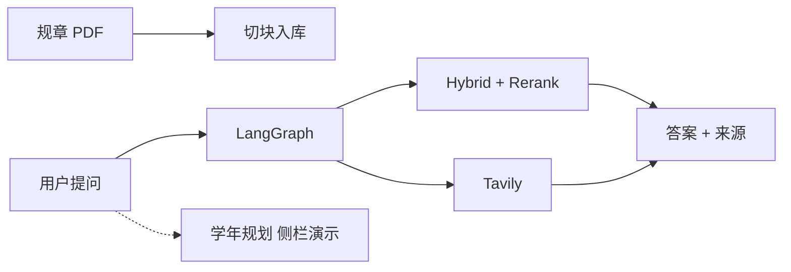

# 制度文档问答（RAG + Agent）

个人项目，**非学校官方产品**。把高校公开教务规章做成可溯源的制度问答：校内规定走知识库，时效资讯可走网页，资料不够就拒答，不编造条款。

语料为岭南师范学院公开 PDF。完整规章文件**未公开收录**（体积与版权）；评测数字针对知识库 RAG 链路。

[](https://www.python.org/)
[](https://fastapi.tiangolo.com/)
[](https://www.langchain.com/)
[](https://langchain-ai.github.io/langgraph/)
[](https://github.com/explodinggradients/ragas)

---

## 项目亮点

1. **制度问答不编造数字**：30 题拒答回归（该答 / 部分答 / 该拒各 10），幻觉 **0/30**，该拒题未编价格、时刻或网址；行为准确 **27/30**，另 3 题是有制度但缺精确字段时整句拒答（过拒，不是胡编）。金标见 `evaluation/refusal_gold.json`。
2. **检索质量有对照，不是调通就算**：50 道自建题 + Ragas，对比有无 Rerank。Context Precision **0.73 → 0.79**，Answer Relevancy **0.65 → 0.83**，Context Recall **0.74 → 0.88**，Faithfulness **0.86 → 0.89**。
3. **答案能指回原文页码**：PDF 按页入库，Recursive 切块（256 / overlap 50）→ Query 改写 → Hybrid（稠密向量 + jieba BM25 + RRF）→ `bge-reranker-v2-m3` 将 Top10 精排为 Top3，回答附 PDF 名与页码。
4. **校内规章和网上新闻不混用**：LangGraph（`summarize` → `think` → `act` → `observe`）按问题选工具——规定走 `search_lingnan_knowledge_base`，公开资讯走 Tavily；Prompt 约束网页结果不得冒充官方规章。
5. **多轮对话前端不回传历史**：只传 `question` + `thread_id`。Graph 用 SQLite checkpointer 存 state，超过 5 轮先摘要再裁剪。

主线是教务 PDF 问答（RAG + LangGraph Agent）。学年规划是侧栏附加演示，见下方「功能演示」。

---

## 技术栈

| 层级 | 技术 |
|------|------|
| 前端 | Streamlit、httpx（SSE） |
| API | FastAPI、Pydantic |
| Agent | LangChain tools、LangGraph、SQLite checkpointer、DeepSeek |
| RAG | Chroma、BGE Embedding、jieba + BM25、RRF、bge-reranker |
| 联网 | Tavily |
| 评估 | Ragas、自建 50 题 / 30 题拒答集 |
| 工程 | Docker Compose、Redis 限流、`.env`；MySQL / JWT 用户接口为附带能力 |

---

## 系统架构



主路径：Streamlit 请求 `POST /agent/stream`（`question` + `thread_id`）。校内规定检索知识库，公开资讯可联网；SSE 推思考、工具步骤、正文和来源。

`POST /chat/stream` 是纯 RAG 兼容链，评测脚本在用。学年规划走 `POST /planning/stream`，按 `session_id` 存在内存，与问答 `thread_id` 分开。

---

## 评测结果

评估针对**知识库 RAG**。完整设置与逐题分析：[docs/evaluation_report.md](./docs/evaluation_report.md)。Agent + 联网路径尚未做同规模对照。

### Ragas（50 题）

| 指标 | 无 Rerank | 有 Rerank | 差值 |
|------|----------:|----------:|-----:|
| Context Precision | 0.73 | **0.79** | +0.06 |
| Context Recall | 0.74 | **0.88** | +0.14 |
| Faithfulness | 0.86 | **0.89** | +0.03 |
| Answer Relevancy | 0.65 | **0.83** | +0.18 |

Rerank 改善进入生成的 Top3，**不能**捞回 Hybrid Top10 以外的块。两边 Recall 仍为 0 的题要回到切块 / 初筛。脚本：`evaluation/eval_with_ragas.py`。

### 拒答回归（30 题）

| 指标 | 结果 |
|------|------|
| 题型 | 该答 10 / 部分答 10 / 该拒 10 |
| 行为准确 | **27/30** |
| 误拒 | **3/30**（心理电话、转专业名额、宿舍房型等「有制度缺字段」时整句拒答） |
| 幻觉 | **0/30**（该拒题未编价格 / 时刻 / 网址） |

脚本：`evaluation/eval_refusal.py`。

---

## 功能演示

**主线：知识库问答（出处为 PDF 名 / 页码）**


**主线：联网搜索（出处为网页标题与链接）**


**附加演示：学年规划（侧栏切换，非主线）**

大一理工科补充年级和专业后出一份本学年安排：校规红线来自知识库检索（会丢掉文件名含「研究生」的命中），竞赛走网页，学习建议才由模型写。Tavily 不可用时仍可出校规。会话在内存中按 `session_id` 隔离，重启即丢。没有规划金标，也没有「单 Prompt vs 工作流」对照。

---

## 难点与工程取舍

1. **中文专名会废掉 BM25**  
   制度问句大量依赖「三助一辅」「学业预警」这类词。正则按连续汉字切时，关键字通道基本失灵，Hybrid Top3 会飘到无关文档。改为 jieba，并把三助一辅、国家奖学金、国家助学金、学业奖学金、保留入学资格、学业预警、勤工助学写入词表后，BM25 才可用。

2. **Rerank 只重排，不扩召回**  
   「怎么申请」类问题里，流程条款常已进 Hybrid Top10，但排在申请条件 / 岗位职责后面，精排能把 Top3 调顺。所需段落若没进 Top10，Rerank 帮不上，要回头查切块和初筛。

3. **缺细节时选择过拒，而不是补全**  
   拒答集幻觉为 0，但 3 题在「有制度、缺电话 / 名额 / 房型」时整句拒答。制度场景里，漏检后胡编比答不全更糟。

4. **规章与网页没有物理隔离的子图**  
   单图 + 一份系统提示绑定两个工具，分流主要靠 Prompt。网页不得写成官方校规，这是约束，不是两个独立 Agent。

---

## 当前不足与后续

- 50 / 30 题不能外推到全部规章问答；Agent 联网路径没有同规模评测  
- 仍有题目两边 Context Recall 为 0，Rerank 救不了  
- 3 题过拒：有相关制度但缺精确字段时整句拒答  
- 学年规划仅为侧栏演示：内存会话、无账号、不与问答自动分流  
- Rerank / Tavily 依赖外部 API；模型无内置实时时钟  

后续优先：补 Agent 联网路径的小规模回归；对 Recall=0 的题回头查切块与初筛；过拒题改为「答能支持的部分 + 声明未覆盖」，而不是整句拒答。

---

## 附录

### 目录

```text
lingnan-university-rag/
├── main.py                 # Streamlit 入口（问答 / 规划）
├── frontend/               # 侧栏、对话、规划页、SSE 客户端
├── app/
│   ├── agent/              # LangGraph：think / act / observe、工具、SSE
│   ├── planning/           # 学年规划演示
│   ├── rag/                # 改写 / Hybrid / Rerank / Tavily
│   └── routers/            # users / auth / chat / agent / planning
├── scripts/ingest_pdfs.py
├── evaluation/             # Ragas 与拒答金标、结果 json
├── docs/evaluation_report.md
└── docker/
```

### API

| 方法 | 路径 | 说明 |
|------|------|------|
| GET | `/health` | 健康检查 |
| POST | `/agent/stream` | 主接口：`{ question, thread_id }`，SSE |
| POST | `/planning/stream` | 规划演示：`{ question, session_id }`，SSE |
| POST | `/chat/stream` | 兼容纯 RAG 流式（评测用） |

### `/agent/stream` SSE 事件

| event | 含义 |
|------|------|
| `thought` | 调用工具前的思考 |
| `action` | 即将调用的工具名与参数 |
| `observation` | 工具返回摘要 |
| `token` | 最终回答的流式增量 |
| `sources` | 知识库页码或网页链接 |
| `error` | 失败信息 |
| `done` | 本轮结束 |
